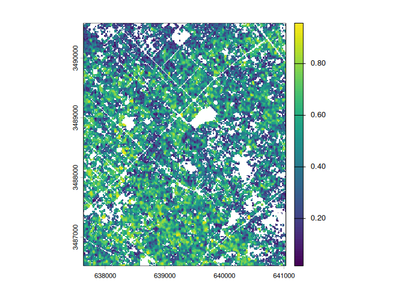
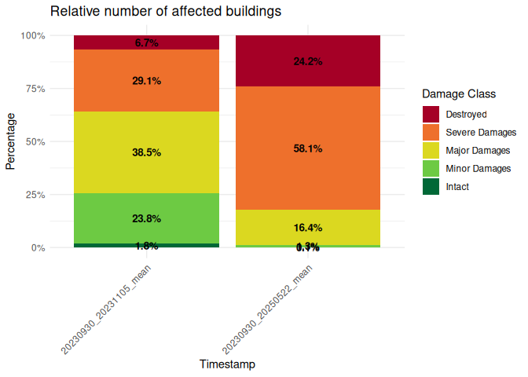
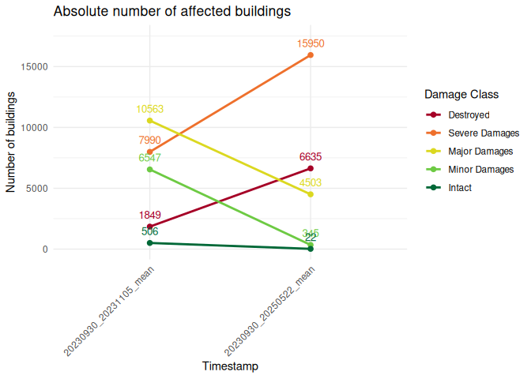

<!-- README.md is generated from README.Rmd. Please edit that file -->

# coheRence

<!-- badges: start -->

<!-- badges: end -->

The goal of **coheRence** is to calculate average coherence values for
individual building polygons within a user-defined region. By utilizing
pre-processed coherence maps (e.g., from Sentinel-1) and building
geometries (e.g., from OpenStreetMap), the package clips spatial data
and computes mean coherence values per building to assess its structural
status.

### Key Features

- **Data Output**: Automatically saves results as GeoPackage (`.gpkg`)
  and `.png` files for seamless integration into GIS environments and
  easy reporting.
- **Workflow Integration**: Implements customizable classification
  schemes to categorize damage levels.
- **Visualization**: Generates colored plots and time-series graphs to
  provide a clear overview of analyzed data.

### Use Cases

This analysis provides a rapid method to combine coherence loss
estimation with built-up areas. It is particularly valuable for
monitoring areas affected by **armed conflicts** or **natural
disasters**. The exported data can be used for further spatial analysis
of damage patterns, either for a specific event or as a longitudinal
time series.

> \[!IMPORTANT\] This package is designed for post-processing and
> analysis. It is **not** capable of downloading raw data or processing
> initial SAR scenes (e.g., from SLC to Coherence).

## Installation

You can install the development version of coheRence from
[GitHub](https://github.com/) with:

``` r
# install.packages("remotes")
remotes::install_github("andeelia/coheRence")
#> 
#> ── R CMD build ─────────────────────────────────────────────────────────────────
#> * checking for file ‘/tmp/Rtmp8oXDUj/remotescb054a207f47/andeelia-coheRence-f81046b/DESCRIPTION’ ... OK
#> * preparing ‘coheRence’:
#> * checking DESCRIPTION meta-information ... OK
#> * checking for LF line-endings in source and make files and shell scripts
#> * checking for empty or unneeded directories
#> * building ‘coheRence_0.1.0.tar.gz’
```

## Workflow

The complete workflow is shown here:

### Load And Clip

The first function takes .tif files from a set path, converts them to a
pre-defined CRS and clips them with building polygons.

``` r
library(coheRence)
library(terra)
library(sf)
library(tictoc)

#define personal variables
path <- '/home/andeelia/Documents/GitHub/package_test/raw_data/'
gaza_crs <- "EPSG:32636" 
final_dir <- '/home/andeelia/Documents/GitHub/package_test/clipped_data/'
buildings <- '/home/andeelia/Documents/GitHub/package_test/raw_data/Gaza_Stripe_buildings.shp'

#call first function to prepare further processing steps
clips <- load_and_clip(data_path = path, target_crs = gaza_crs, buildings_path = buildings, save_clips = TRUE, project_path = final_dir)
#> [1] "File loaded:/home/andeelia/Documents/GitHub/package_test/raw_data//20230930_20231105.tif"
#> [2] "File loaded:/home/andeelia/Documents/GitHub/package_test/raw_data//20230930_20250522.tif"
#> Data acquisition and Preparation: 0.303 sec elapsed
#> Reading layer `Gaza_Stripe_buildings' from data source 
#>   `/home/andeelia/Documents/GitHub/package_test/raw_data/Gaza_Stripe_buildings.shp' 
#>   using driver `ESRI Shapefile'
#> Simple feature collection with 329401 features and 13 fields
#> Geometry type: MULTIPOLYGON
#> Dimension:     XY
#> Bounding box:  xmin: 34.22009 ymin: 31.22144 xmax: 34.56517 ymax: 31.58946
#> Geodetic CRS:  WGS 84
#> Prepare the building data: 20.294 sec elapsed
#> Clipping raster with buildings: 0.426 sec elapsed
#> Global runtime:: 21.025 sec elapsed
```

The result of this function is a list consisting of three things.

- A list of SpatRaster objects, clipped to the building outlines

``` r
plot(clips[[1]][[1]])
```



- A spatial DataFrame including the buildings clipped to the extent of
  the input images

``` r
head(clips[[2]])
#> Simple feature collection with 6 features and 13 fields
#> Geometry type: MULTIPOLYGON
#> Dimension:     XY
#> Bounding box:  xmin: 639270.6 ymin: 3488704 xmax: 641066 ymax: 3490583
#> Projected CRS: WGS 84 / UTM zone 36N
#>     osm_id code   fclass                            name   type
#> 1 41243116 1500 building             Khaled Ben Alwaleed   <NA>
#> 2 41243192 1500 building                    مسجد الزهراء   <NA>
#> 3 41243835 1500 building                Nama Club Sports   <NA>
#> 4 41244014 1500 building             Palestinian Telecom public
#> 5 41244046 1500 building         Jabbalia Sewerage plant   <NA>
#> 6 41244173 1500 building Youth House for Culture and Art public
#>                    ADM0_EN ADM0_PCODE       date    validOn validTo Shape_Leng
#> 1 State of Palestine (the)         PS 2021-03-18 2023-10-19    <NA>   6.006026
#> 2 State of Palestine (the)         PS 2021-03-18 2023-10-19    <NA>   6.006026
#> 3 State of Palestine (the)         PS 2021-03-18 2023-10-19    <NA>   6.006026
#> 4 State of Palestine (the)         PS 2021-03-18 2023-10-19    <NA>   6.006026
#> 5 State of Palestine (the)         PS 2021-03-18 2023-10-19    <NA>   6.006026
#> 6 State of Palestine (the)         PS 2021-03-18 2023-10-19    <NA>   6.006026
#>   Shape_Area AREA_SQKM                       geometry
#> 1   0.574021   6019.62 MULTIPOLYGON (((640506.1 34...
#> 2   0.574021   6019.62 MULTIPOLYGON (((640978 3490...
#> 3   0.574021   6019.62 MULTIPOLYGON (((641032.8 34...
#> 4   0.574021   6019.62 MULTIPOLYGON (((639280.2 34...
#> 5   0.574021   6019.62 MULTIPOLYGON (((640903.9 34...
#> 6   0.574021   6019.62 MULTIPOLYGON (((640905.2 34...
```

- A numerical value, representing the number of input images

``` r
print(clips[[3]])
#> [1] 2
```

### Coherence Calculation

By assigning the results from `load_and_clip()` to variables, they can
be used in the following function:

``` r
library(coheRence)
library(terra)
library(sf)
library(tictoc)

#assign results from load_andclip
clipped_raster <- clips[[1]]
clipped_buildings <- clips[[2]]

#call second function to analyse your dataset
coh_results <- coh_calc(rast_data = clipped_raster, buildings = clipped_buildings, target_crs =  gaza_crs, project_path = final_dir)
#> Prepare the building data: 0.732 sec elapsed
#> Coherence analysis per building: 71.76 sec elapsed
#> Global runtime:: 72.493 sec elapsed
```

The result of this function looks like this:

``` r
head(coh_results)
#>     osm_id code   fclass                            name   type
#> 1 41243116 1500 building             Khaled Ben Alwaleed   <NA>
#> 2 41243192 1500 building                    مسجد الزهراء   <NA>
#> 3 41243835 1500 building                Nama Club Sports   <NA>
#> 4 41244014 1500 building             Palestinian Telecom public
#> 5 41244046 1500 building         Jabbalia Sewerage plant   <NA>
#> 6 41244173 1500 building Youth House for Culture and Art public
#>                    ADM0_EN ADM0_PCODE       date    validOn validTo Shape_Leng
#> 1 State of Palestine (the)         PS 2021-03-18 2023-10-19    <NA>   6.006026
#> 2 State of Palestine (the)         PS 2021-03-18 2023-10-19    <NA>   6.006026
#> 3 State of Palestine (the)         PS 2021-03-18 2023-10-19    <NA>   6.006026
#> 4 State of Palestine (the)         PS 2021-03-18 2023-10-19    <NA>   6.006026
#> 5 State of Palestine (the)         PS 2021-03-18 2023-10-19    <NA>   6.006026
#> 6 State of Palestine (the)         PS 2021-03-18 2023-10-19    <NA>   6.006026
#>   Shape_Area AREA_SQKM 20230930_20231105_mean 20230930_20250522_mean
#> 1   0.574021   6019.62              0.7367099              0.2239051
#> 2   0.574021   6019.62              0.2626309              0.1523930
#> 3   0.574021   6019.62              0.4664691              0.5022483
#> 4   0.574021   6019.62              0.3970907              0.4064044
#> 5   0.574021   6019.62              0.4689693              0.4139251
#> 6   0.574021   6019.62              0.5520670              0.2226530
```

### Classified Plots

As you can see, the calculated results are added to the end of the DF.
Finally, two plots will be created by calling classified plots:

``` r
library(coheRence)
library(tictoc)
library(ggplot2)
library(dplyr)
library(tidyr)
library(scales)
library(patchwork)

#assign result from load_and_clip
image_count <- clips[[3]]

#call function to plot graphs
classified_plots(coh_df = coh_results, number_of_images = image_count, project_path = final_dir)
#> Preparing the DF: 0.003 sec elapsed
#> Plot bar chart: 0.324 sec elapsed
#> Plot line charts: 0.333 sec elapsed
#> Global runtime:: 0.695 sec elapsed
#> 1.357 sec elapsed
```



## Citation

To cite **coheRence** in publications, please use:

> Andersch, E. (2026). coheRence: Coherence loss analysis based on
> building polygons and coherence maps. R package version 0.1.0. URL:
> <https://github.com/andeelia/coheRence>

Alternatively, you can run `citation("coheRence")` in R to get the
BibTeX entry.
